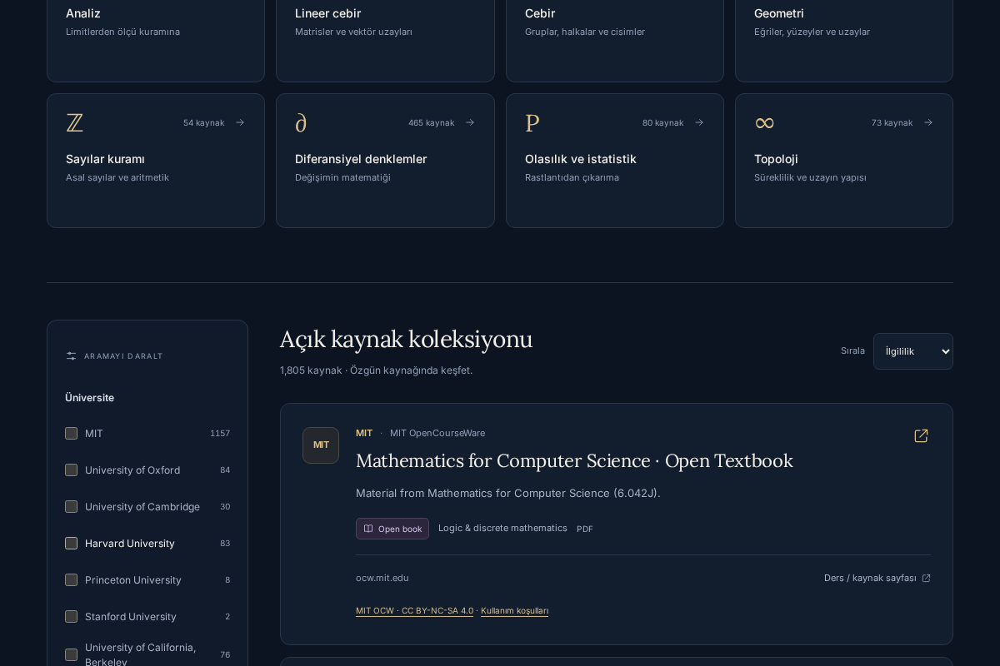

# Matris — Açık Matematik Kaynakları

[Canlı siteyi aç](https://matris-matematik.higgsfield.app)

Matris; dünyanın ve Türkiye’nin üniversitelerinden **1.805 açık erişimli matematik kaynağını**, **18 üniversite** altında bir araya getiren bir arama sitesidir. Ders notları, açık kitaplar ve problem setleri bulunabilir. Her sonuç, belgenin yayımlandığı özgün siteye götürür.



## Özellikler

- Kaynak, konu, yazar ve üniversite adına göre arama.
- Üniversite, konu alanı ve materyal türü filtreleri.
- Konu kartları, üniversite kısayolları, sıralama ve sayfalama.
- Türkçe karakterleri ve pde / ode / linalg gibi İngilizce kısaltmaları destekleyen arama.
- Koyu akademik tasarım; tablet ve telefona uyumlu düzen.
- Paylaşılabilir arama adresleri; filtre değişiminde kaydırma konumunun korunması.

Arama, eklenmiş katalog kayıtlarında yapılır; canlı bir internet taraması değildir. Matris belge içeriklerini barındırmaz. Kaynakların erişimi zaman içinde değişebilir.

## iPad’den kullanmak ve düzenlemek

Siteyi kullanmak için yukarıdaki canlı site bağlantısını Safari’de açman yeterlidir.

Kod düzenlemek için GitHub’da bu deponun **Code → Codespaces → Create codespace on main** bölümünü kullanabilirsin. Codespaces açıldığında terminalde:

```sh
cd matris-matematik
bun install
bun run dev
```

**Ports** bölümündeki **5173** portunu tarayıcıda aç. Codespaces kullanılabilirliği ve kullanım kotası GitHub hesabına bağlıdır. Depoda Matris için bir geliştirme ortamı yapılandırması bulunur.

GitHub’a yapılan değişiklikler mevcut Higgsfield sitesini otomatik güncellemez. Bu klasör, çalışan Matris uygulamasının bağımsız geliştirilebilen kaynak kopyasıdır.

## Yerel geliştirme

Node.js **22.12 veya üzeri** ve Bun **1.4 veya üzeri** gerekir. Gizli anahtar veya veritabanı gerekmez.

```sh
cd matris-matematik
bun install --frozen-lockfile
bun run dev
```

Üretim derlemesi ve önizleme:

```sh
bun run build
bun run preview
```

Önizleme adresi: `http://localhost:4173`.

React 19, TypeScript, TanStack Start/Router ve Vite kullanılır. Sunucu çıktısı `dist/server/server.js`, tarayıcı dosyaları `dist/client` altındadır. Bu SSR uygulaması GitHub Pages’e yalnızca dosya yükleyerek çalışmaz; mevcut canlı site ayrı olarak yayımlanmıştır.

## Dosyalar

| Konum | İçerik |
| --- | --- |
| `src/search/MatrisOpenMathematicsSearch.tsx` | Arama ve kaynak arayüzü |
| `src/search/MatrisSearch.css` | Koyu tema ve responsive düzen |
| `src/search/catalog.ts` | Ana kaynak kataloğu |
| `src/search/catalog-tr.ts` | Türkiye kaynakları |
| `src/search/search.ts` | Arama eşleştirmesi |
| `src/search/universities.ts` | Üniversite bilgileri |
| `scripts/` | Önizleme ve kontroller |
| `catalog-research/tr-document-checks.json` | Yeni kaynakların bağlantı doğrulama kayıtları |

Görünüm, arama kodu ve katalog çalışan siteden alınmıştır; GitHub sürümünde barındırma platformuna özel editör altyapısı ve kullanılmayan şablon paketleri bulunmaz. Sürümün dayandığı kaynak kaydı: `9e790f6` (kaydırma düzeltmesi dahil).

## Testler

```sh
bun run test:catalog
bunx playwright install chromium
```

Başka bir terminalde `bun run preview` çalışırken:

```sh
bun run test:ui
bun run test:scroll
bun run test:a11y
```

Testler kaynak sayısını, aramayı, filtreleri, konu kısayollarını, bağlantıları, ekran genişliklerini ve kaydırma hatasını kontrol eder. Erişilebilirlik testi axe-core kullanır. GitHub Actions iş akışı Matris klasöründeki değişiklikleri doğrular.

## Kaynaklar ve lisanslar

Materyallerin ve katalog verilerinin kaynak atıfları için [SOURCE-LICENSES.md](SOURCE-LICENSES.md) dosyasına bak. Açık erişim, sınırsız yeniden yayımlama izni anlamına gelmez. MIT, Ankara ve ODTÜ kayıtlarında ilgili Creative Commons atıfları korunur.

Uygulama kodu için ayrıca bir açık kaynak lisansı seçilmemiştir. Bu depoda PDF, ders kitabı veya çözümlerin kopyaları bulunmaz.
